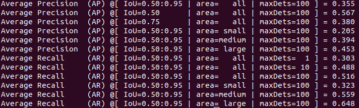
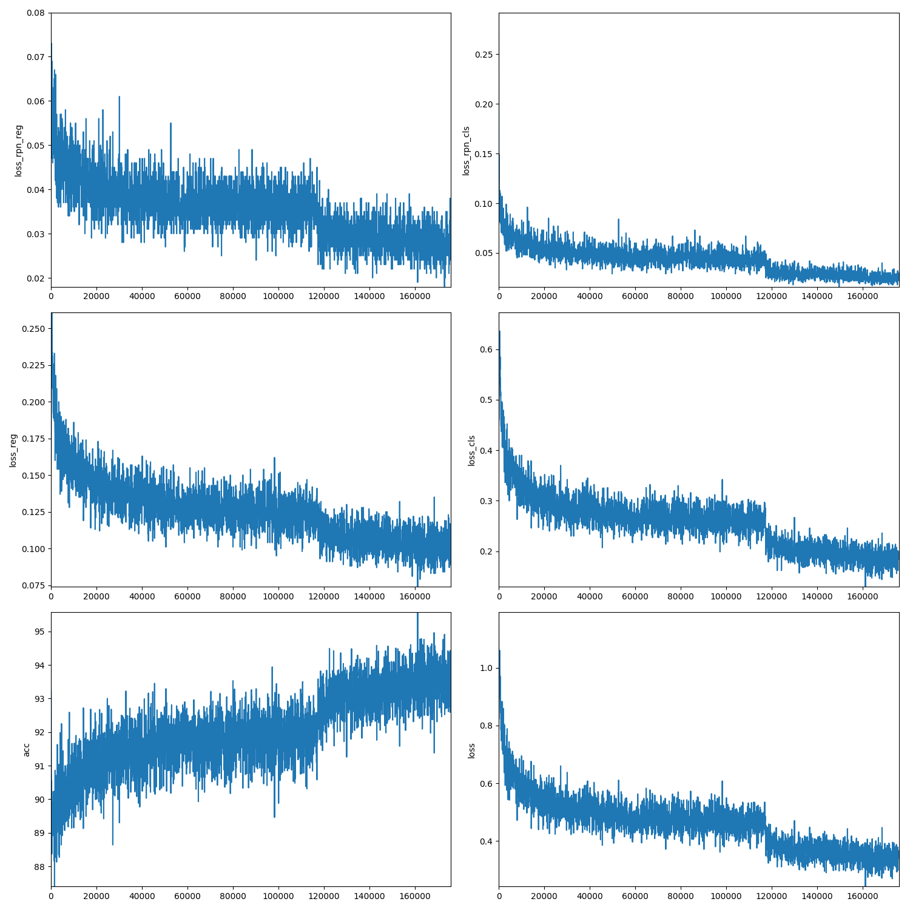
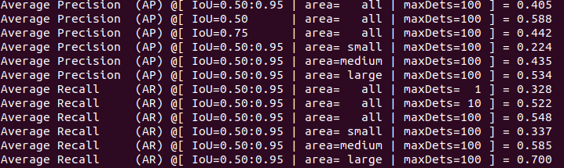
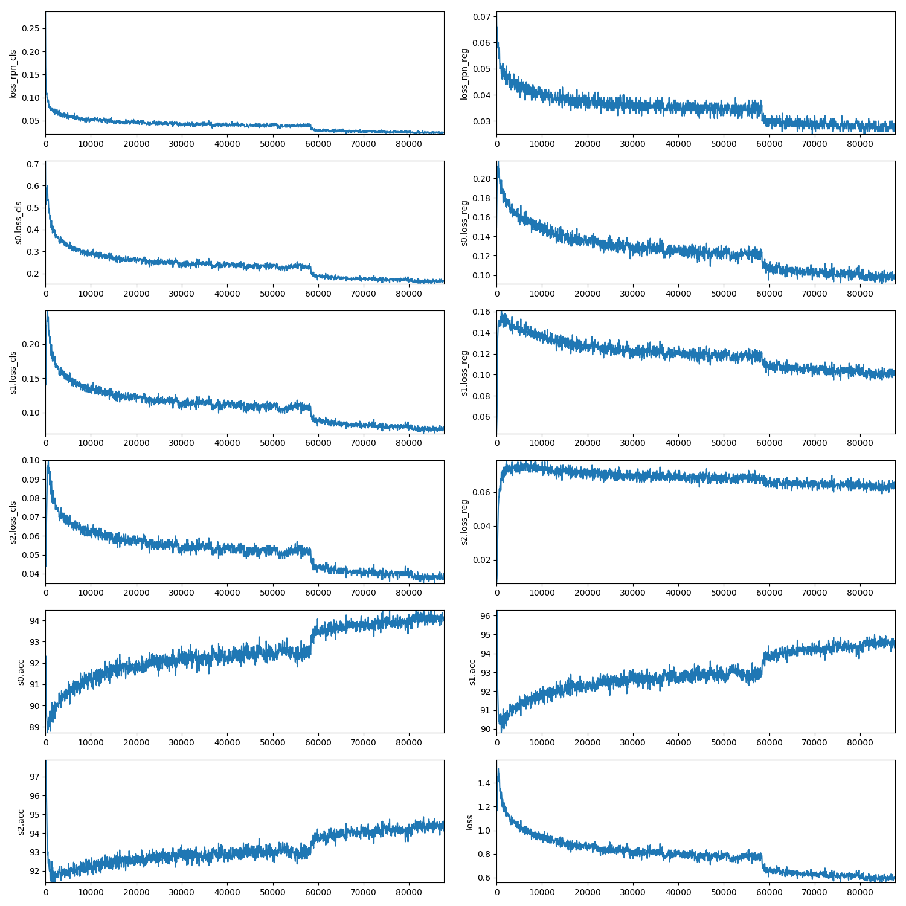
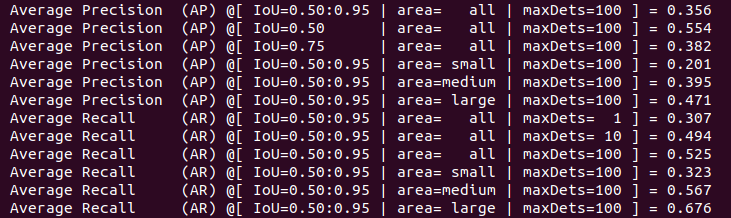
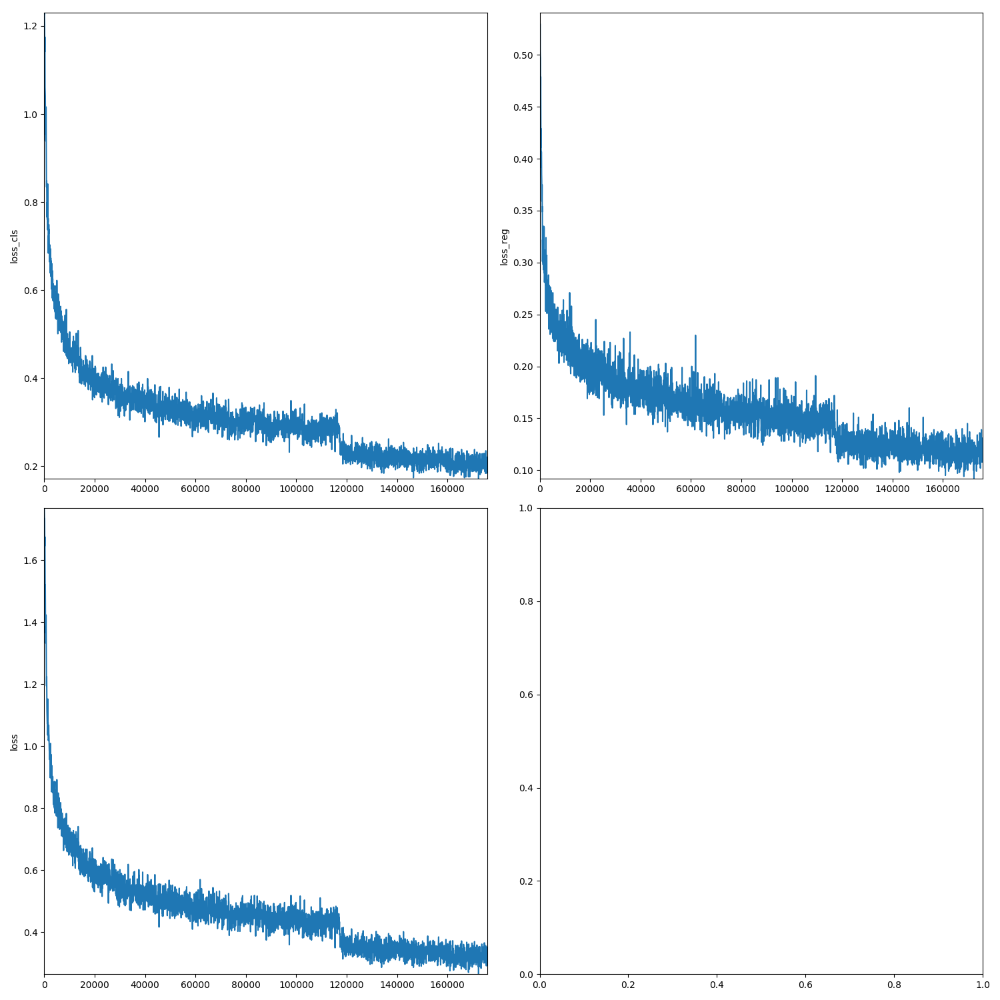

# To reproduce some important object detection experiment.

## To do list:
### Two stages:
| backbone | name | FPN | cascade | GN | tricks | AP50:90 |
| :--- | :----: | :---: | :---: | :----: | :----: | ---: |
| res50| Faster RCNN  | ✔ |   |   |    | 35.5 | 
| res50| Faster RCNN  | ✔ | ✔ |   |    | 40.5 |	
| res50| Faster RCNN  | ✔ | ✔ |	✔ |
| res101| Faster RCNN | ✔
| res101| Faster RCNN | ✔ | ✔ |	
| res101| Faster RCNN | ✔ | ✔ |	✔ |
### One stage:
| backbone | name | tricks |AP50:90 |
| :--- | :----: | :---: | :---: | :----: |----: |
| res50  | RPN       |  |
| res50  | RetinaNet |  |	35.6 |
| res50  | RPN       |  |
| res101 | RetinaNet |  |
| VGG16  | SSD300    |  |	
| VGG16  | SSD512    |  |

---
### 1. Faster RCNN(FPN)
| backbone | our AP 0.50:0.95(mmdetection) | training time |
| :--- | :----: | ---: |
| ResNet50 | 35.5(36.4) | 26h (4 titanxp , distributed) | 
| ResNet101 |  |
#### ResNet50

***

### 2. Cascade-RCNN(FPN)

| backbone | AP 0.50:0.95 | training time |
| :--- | :----: | ---: |
| ResNet50 | 40.5(40.3) | 34h (8 titanxp , nondistributed) |
| ResNet101 |  |
#### ResNet50

***

### 3. RetinaNet
| backbone | AP 0.50:0.95 | training time |
| :--- | :----: | ---: |
| ResNet50 | 35.6(35.8)  | 25h(4 titanxp , distributed) |
| ResNet101 |  |

