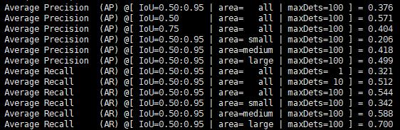
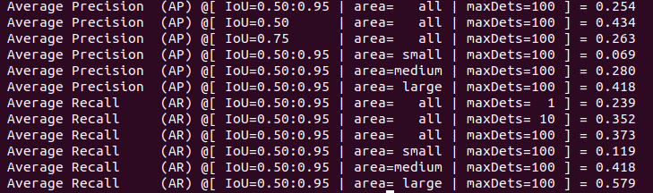
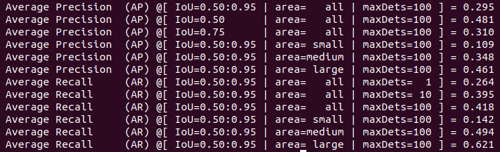

# To reproduce some important object detection experiment.

## To do list:
### Two stages:
| backbone | name | FPN | cascade | tricks | AP50:90 |
| :--- | :----: | :---: | :---: | :----: | :----: | 
| res50| Faster RCNN  | ✔ |   |   |  35.5 | 
| res50| Faster RCNN  | ✔ | ✔ |   |  40.5 |	
| res101| Faster RCNN | ✔ |   |   |       |
| res101| Faster RCNN | ✔ | ✔ |	  |       |

### One stage:
| backbone | name | tricks |AP50:90 |
| :--- | :----: | :---: | :---: | 
| res50  | RetinaNet |  |	35.6 |
| res101 | RetinaNet |  |   37.6 |
| VGG16  | SSD300    |  |	25.4 | 
| VGG16  | SSD512    |  |   29.5 |

### proposal
| backbone | name | tricks | AR100 | AR300 | AR1000 |
| :--- | :----: | :---: | :---: |:---: |:---: |
| res50  | RPN  |  | 42.82 | 51.44 | 57.25(57.1) |
| res101  | RPN |  | 0.4545 | 0.5337 | 58.66(58.6) |

***
### 1. Faster RCNN(FPN)
| backbone | our AP 0.50:0.95(mmdetection, paper) | training time |
| :--- | :----: | ---: |
| ResNet50 | 35.5(36.4, 33.9) | 26h (4 titanxp , distributed) | 
| ResNet101 |  (38.6, 36.2)| |
#### ResNet50

***

### 2. Cascade-RCNN(FPN)

| backbone | AP 0.50:0.95(mmdetection, paper) | training time |
| :--- | :----: | ---: |
| ResNet50 | 40.5(40.3,40.3) | 34h (8 titanxp , nondistributed) |
| ResNet101 | (42.1, 42.7)   |                                  |  
#### ResNet50

***

### 3. RetinaNet
| backbone | AP 0.50:0.95(mmdetection, paper) | training time |
| :--- | :----: | ---: |
| ResNet50 | 35.6(35.8, 35.7)  | 25h(4 titanxp , distributed) |
| ResNet101 |  37.6(37.7, 37.8)| 33h(4 titanxp , distributed) |
#### ResNet50

#### ResNet101

***

### 4. SSD
| image size | AP 0.50:0.95(mmdetection, paper) | training time |
| :--- | :----: | ---: |
| 300 | 25.4(25.7, 23.2)  | 71h(4 titanxp, distributed, 24epoch) |
| 512 | 29.5(29.3, 26.8)  | 73h(4 titanxp, distributed, 24epoch) |
#### SSD300

#### SSD512
